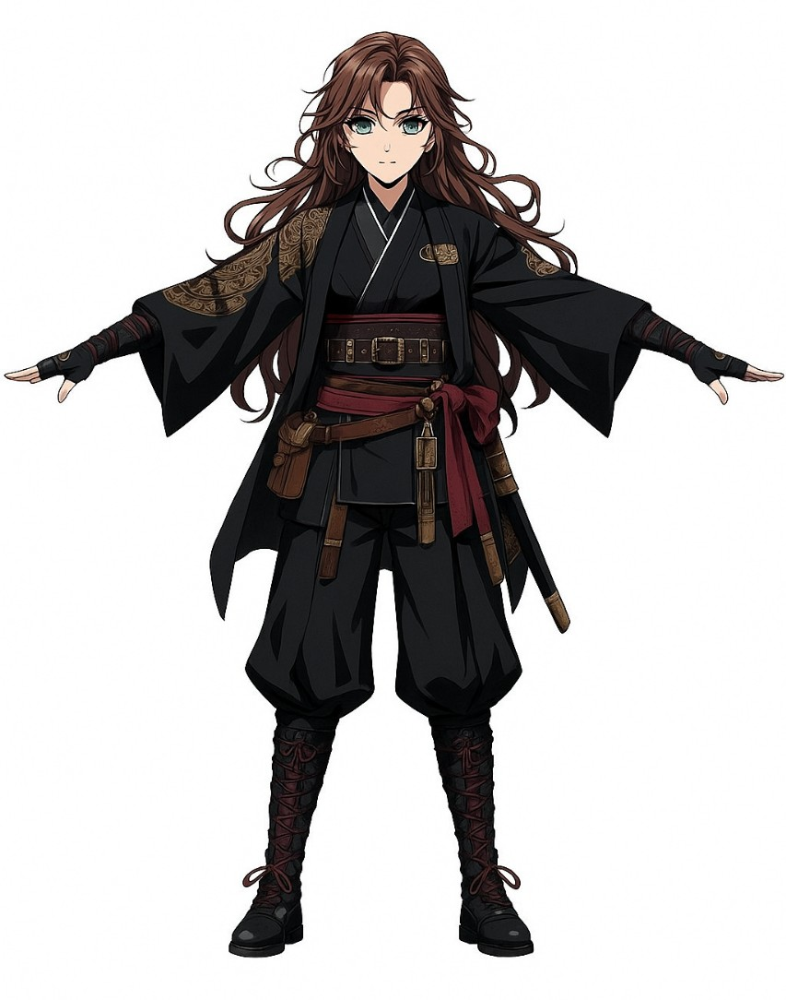
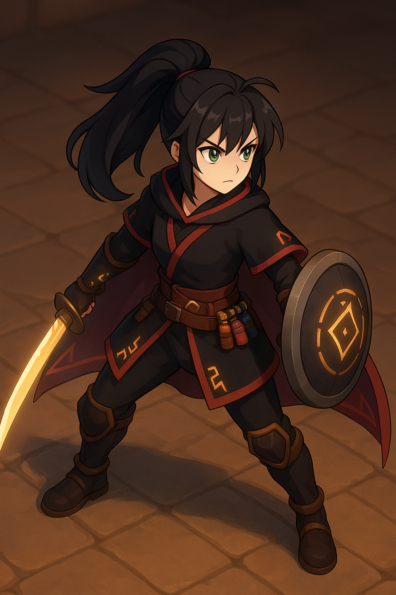
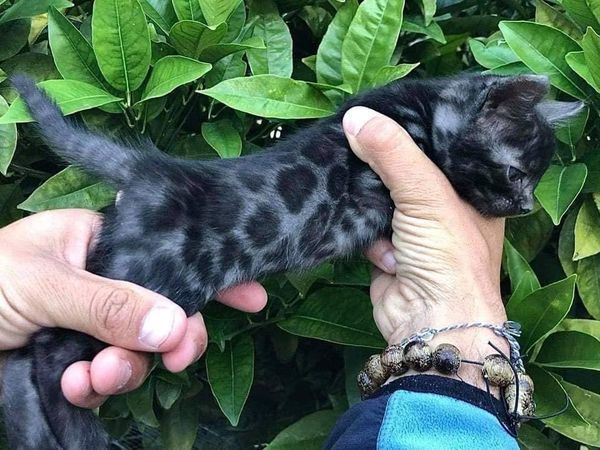
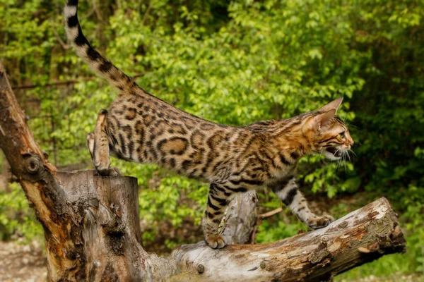
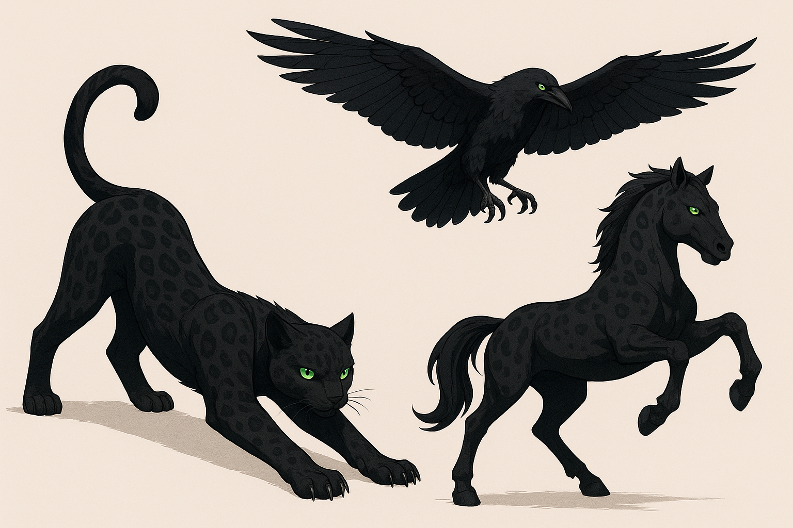
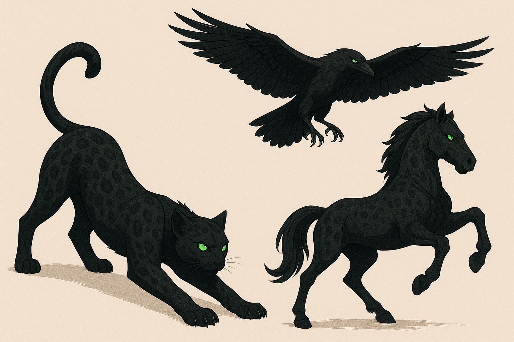

# 🎨 Documento de Direção de Arte – Lucy & Nero (Isométrico 3D)

## 1. Visão Geral

A direção de arte busca um estilo 3D estilizado com texturas pictóricas, combinando a expressividade de animes de alta qualidade com a atmosfera sombria e imersiva de ARPGs clássicos. As referências principais são o design de personagens de *Hades* e *Genshin Impact*, a atmosfera de *Diablo III*, e a clareza visual de *League of Legends*.

O contraste entre luz e sombra é fundamental, com a magia de Lucy e os padrões de Nero servindo como pontos de luz em ambientes muitas vezes escuros.

---

## 2. Design de Personagens

### Lucy
- **Modelo:** 3D, seguindo as proporções e traços definidos na ficha de personagem. O modelo deve ser detalhado o suficiente para transmitir sua agilidade e força, com atenção especial aos materiais de sua roupa (tecido, couro, metal).
- **Magia:** As runas em suas roupas e armas devem ser emissivas, brilhando com intensidade variável conforme o uso de mana. A cor da emissão pode mudar com o elemento ativo (vermelho para fogo, azul para gelo, etc.).

<table style="width: 100%; table-layout: fixed; border-collapse: collapse;">
  <tr>
    <td style="padding: 0;">
      

        
      

    </td>
    <td style="padding: 0;">
      

        
      

    </td>
    <td style="padding: 0;">
      

        
      

    </td>
  </tr>
</table>

### Nero
- **Modelos:** Cada forma (Gato, Corvo, Cavalo) deve ter uma silhueta clara e distinta para fácil reconhecimento em combate.
- **Textura:** O padrão de pelagem do Bengal melanístico é a assinatura visual. Deve ser aplicado de forma estilizada, com rosetas que podem ter um brilho sutil e mágico.
- **Metamorfose:** A transição entre formas deve ser um espetáculo visual, com efeitos de partículas, luz e distorção que a tornam um momento impactante no gameplay.

<table style="width: 100%; table-layout: fixed; border-collapse: collapse;">
  <tr>
    <td style="padding: 0;">
      

        
      

    </td>
    <td style="padding: 0;">
      

        
      

    </td>
  </tr>
</table>

<table style="width: 100%; table-layout: fixed; border-collapse: collapse;">
  <tr>
    <td style="padding: 0;">
      

        
      

    </td>
    <td style="padding: 0;">
      

        
      

    </td>
  </tr>
</table>

---

## 3. Design de Ambientes

- **Estilo:** Os cenários serão construídos em 3D, com uma câmera isométrica fixa ou com leves movimentos. A verticalidade será explorada para criar arenas interessantes e pontos de vantagem.
- **Biomas:** Cada região terá uma paleta de cores e identidade visual forte:
    - **Florestas Assombradas:** Tons de azul escuro, verde e roxo, com neblina volumétrica e feixes de luar.
    - **Ruínas de Cristal:** Ambientes com cristais gigantes que refratam a luz e criam efeitos cáusticos.
    - **Pântanos Vulcânicos:** Contraste entre a lama escura, rios de lava laranja e fumaça densa.
- **Iluminação:** Iluminação dinâmica em tempo real é crucial. Fontes de luz como tochas, magia e os próprios personagens criarão um jogo de luz e sombra que afeta a atmosfera e a jogabilidade.

---

## 4. Efeitos Visuais (VFX)

- **Clareza:** Os efeitos devem ser bonitos e impactantes, mas sem poluir a tela. A legibilidade do combate é prioridade.
- **Magia de Lucy:** Cada encantamento de arma deve ter um feedback visual claro (lâmina em chamas, rastro de gelo, arco voltaico).
- **Habilidades de Nero:** Os ataques especiais e de vínculo devem ter VFX únicos e memoráveis que comuniquem claramente sua área de efeito e poder.
- **Impacto:** Golpes, aparadas (parry), e esquivas devem ser acompanhados de partículas e flashes que dão peso e satisfação ao combate.

---

## 5. Interface (UI)

- **Estilo:** Moderna, limpa e minimalista, com elementos que remetem às runas e à forja.
- **HUD:** As barras de vida, mana e sinergia devem ser claras e posicionadas de forma a não obstruir a visão do jogo.
- **Ícones:** Habilidades, itens e status terão ícones estilizados e fáceis de diferenciar.
