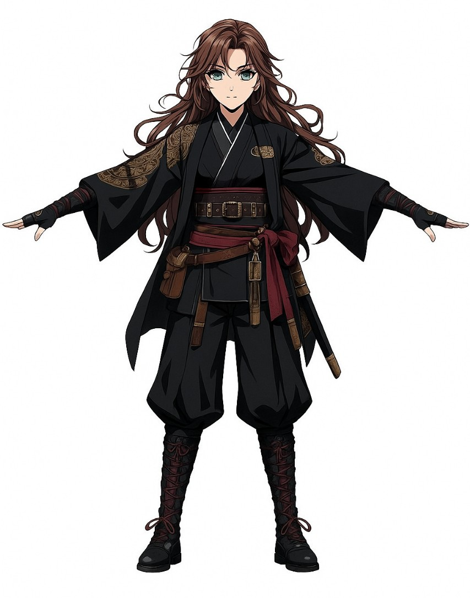
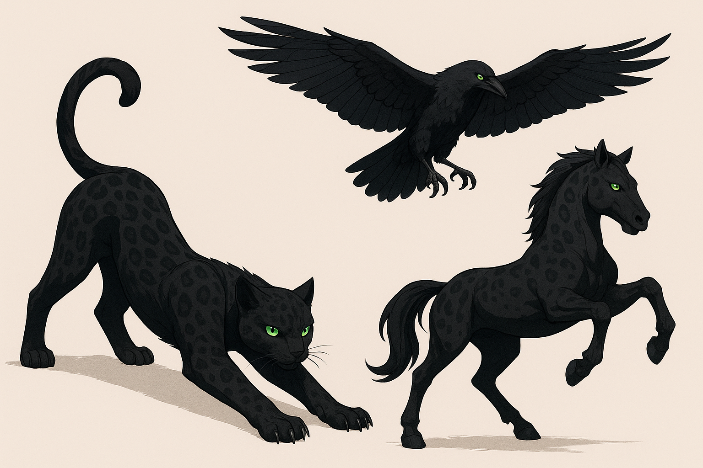

# 🌌 Ficha de Personagens – Lucy & Nero

**Título:** Entre Espadas e Garras

---

## 👤 Lucy – A Forjadora da Luz

### Aparência

- **Idade:** 19 anos
- **Altura:** 1,75 m
- **Cabelo:** Longo, ondulado, preto/moreno, geralmente preso em rabo de cavalo.
- **Olhos:** Verde-esmeralda, que brilham intensamente quando canaliza magia.
- **Constituição:** Atlética e ágil, músculos definidos por anos de treinamento.
- **Pele:** Clara, com algumas cicatrizes de batalhas.

### Trajes e Equipamentos

- **Traje Principal:** Kimono de batalha preto com detalhes em vermelho e dourado.
- **Top:** Ajustado, mangas longas com runas douradas que brilham com magia.
- **Calças:** Flexíveis e reforçadas nos joelhos/canelas com placas leves.
- **Botas:** Resistentes, feitas para combate e longas jornadas.
- **Luvas:** Sem dedos, marcadas com runas protetoras.
- **Acessórios:**
    - Cinto com poções, ferramentas e itens de forja.
    - Capa curta com runas defensivas (removível).

### Armas Principais

- **Katana:** Lâmina curva com runas gravadas, que brilham conforme o elemento imbuído.
- **Arco Longo:** Estrutura leve, decorada com runas que ativam efeitos mágicos; flechas podem ser encantadas.
- **Escudo:** Redondo, leve, runas reforçadoras de defesa.

### Poderes – Forja Mágica

- **Habilidade Única:** Lucy não conjura magias convencionais (como bolas de fogo).
- **Forja Mágica:** Ela cria armas/armaduras encantadas com propriedades específicas.
- **Combinação:** O material + sua mana pura = efeitos elementais (fogo, água, eletricidade, vento).
- **Economia de Mana:** Forjar gasta pouca mana, mas usar as armas imbuídas consome bastante, pois a reação é alimentada por sua energia vital.

<table style="width: 100%; table-layout: fixed; border-collapse: collapse;">
  <tr>
    <td style="padding: 0;">
      

        
      

    </td>
    <td style="padding: 0;">
      

        
      

    </td>
  </tr>
</table>

---

## 🐾 Nero – Guardião Metamorfo

### Aparência

Nero é uma criatura metamorfa que assume diversas formas, todas mantendo o padrão de um Bengal melanístico:

- Pelagem/Penas pretas com rosetas e manchas visíveis em tons diferentes de cinza e preto.
- Olhos verdes felinos, intensos e brilhantes, presentes em todas as formas.
- Inspirado na raça de Bengal, um híbrido entre o gato doméstico e o leopardo asiático. Essa linhagem confere a ele um corpo musculoso, ágil e perfeitamente adaptado para o combate e caçadas, mantendo toda a força e destreza de um predador nato. 
- Apesar de sua aparência selvagem e instintos de caça apurados, o Bengal é conhecido por ser extremamente dócil, carinhoso e brincalhão com aqueles em quem confia, combinando instinto felino e inteligência em um equilíbrio fascinante de comportamento e físico.

<table style="width: 100%; table-layout: fixed; border-collapse: collapse;">
  <tr>
    <td style="padding: 0;">
      

        
      

    </td>
    <td style="padding: 0;">
      

        
      

    </td>
  </tr>
</table>

### Formas Atuais

#### 🐈 Forma Gato

- Ágil e furtivo, excelente em emboscadas e combate próximo.
- **Garras Rúnicas:** Próteses forjadas por Lucy, permitem canalizar mana em cortes.
- **Rasgo Sombrio:** Ataque que deixa marcas mágicas instáveis nos inimigos.
- **Predador Silencioso:** Pode atravessar brevemente obstáculos para reposicionamento.

#### 🦅 Forma Corvo

- Forma aérea, usada para vigilância e ataques rápidos.
- **Talons Rúnicos:** Garras reforçadas que conduzem magia.
- **Voo Rasante:** Investida cortante.
- **Chuva de Penas:** Projéteis imbuídos com mana.
- **Olho do Vigia:** Revela inimigos ocultos e amplia a visão de Lucy.

#### 🐎 Forma Cavalo

- Forma de montaria, resistente e voltada para impacto.
- **Ferraduras Rúnicas:** Casco encantado, usado para canalizar poder.
- **Investida Trovejante:** Corrida que gera onda de impacto.
- **Pilar da Terra:** Tremor ao bater os cascos.
- **Aura de Guardião:** Reforça temporariamente as defesas de Lucy.

#### 🌑 Forma Sombra

- Forma espiritual/metafísica. Nero se funde à sombra de Lucy.
- **Camuflagem Total:** Permanece invisível no ambiente.
- **Instinto Sombrio:** Pode emergir da sombra de Lucy instantaneamente, seja para interceptar um ataque ou golpear um inimigo pelas costas.

<table style="width: 100%; table-layout: fixed; border-collapse: collapse;">
  <tr>
    <td style="padding: 0;">
      

        
      

    </td>
    <td style="padding: 0;">
      

        
      

    </td>
  </tr>
</table>

---

## 🎮 Vínculo Heroína & Guardião

- Lucy pode imbuir runas em armas ou equipamentos de Nero, permitindo ataques sincronizados.
- O vínculo entre os dois faz com que Nero atue como extensão da própria Lucy, seja como montaria, suporte aéreo, sombra defensiva ou aliado em combate direto.
